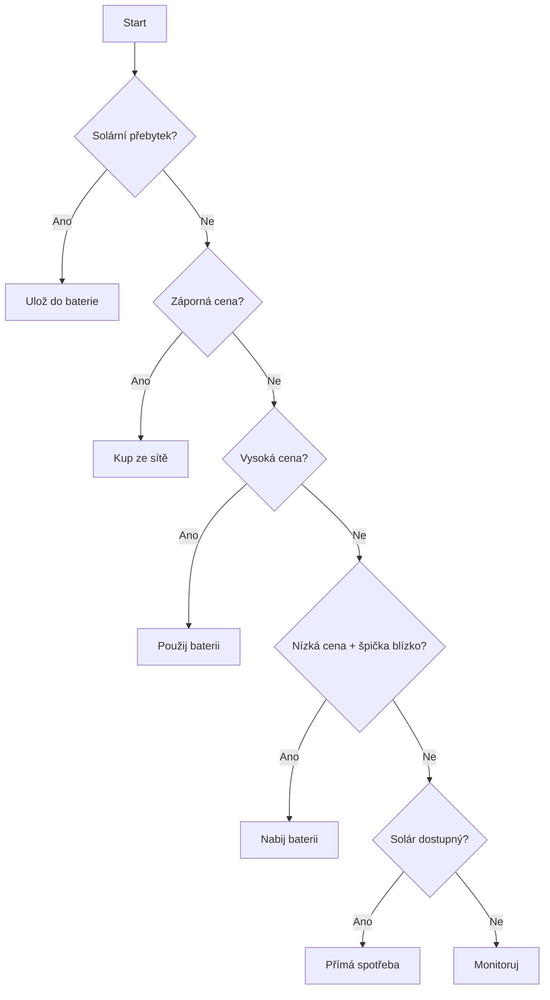

# Cubee Self-Consumption Optimizer v2.0

🔋 Inteligentní optimalizace vlastní spotřeby energie z fotovoltaiky a baterie na základě reálných spotových cen elektřiny.

## 📋 Obsah

- [O projektu](#o-projektu)
- [Instalace](#instalace)
- [Použití](#použití)
- [Konfigurace](#konfigurace)
- [Architektura](#architektura)
- [Changelog](#changelog)

## 🎯 O projektu

### Problém
Klasická arbitráž (nákup energie v levných hodinách, prodej v drahých) **není výnosná** s reálnými cenami:
- Cenový spread: pouze **0.48 CZK/kWh**
- Po započtení účinnosti baterie (90%): **0.43 CZK/kWh**
- Po transakčních nákladech: **0.28 CZK/kWh** ❌

### Řešení
**Self-consumption** (maximalizace vlastní spotřeby ze solár):
- Úspora: **6+ CZK/kWh** (cena ze sítě)
- ROI: **90+ CZK denně**
- Výnosnost: **VŽDY** ✅

### Optimalizační strategie

Priorita akcí:
1. **🌞 Uložit solární přebytek** → nejvyšší priorita
2. **⚡ Koupit při záporných cenách** → dostáváte zaplaceno!
3. **🔋 Použít baterii při vysokých cenách** → úspora
4. **🔌 Nabít před špičkou** → příprava na vysoké ceny
5. **🏠 Přímá spotřeba** → nejefektivnější využití solár

## 🚀 Instalace

### Požadavky
- Python 3.8+
- NumPy
- `cubee_price_calculator` modul (pro reálné ceny)

### Krok 1: Naklonujte repozitář
```bash
cd ~/apps
git clone <repo-url>
# nebo stáhněte soubory přímo
```

### Krok 2: Nainstalujte závislosti
```bash
pip3 install numpy
# cubee_price_calculator musí být v PYTHONPATH
```

### Krok 3: Spusťte optimizer
```bash
python3 cubee_self_consumption_optimizer_v2.py
```

## 📖 Použití

### Základní použití
```bash
python3 cubee_self_consumption_optimizer_v2.py
```

Výstup:
- Tiskne denní report do konzole
- Ukládá report do `/Users/m.a.j.puzik/apps/cubee_optimization_report_YYYYMMDD_HHMM.txt`
- Loguje demo optimalizační rozhodnutí

### Programové použití
```python
from cubee_self_consumption_optimizer_v2 import (
    RealPriceProvider,
    SelfConsumptionOptimizer,
)

# Inicializace
price_provider = RealPriceProvider()
optimizer = SelfConsumptionOptimizer(price_provider)

# Získej ekonomickou analýzu
economics = optimizer.analyze_economics()
print(f"Doporučení: {economics['recommendation']}")

# Získej optimalizační strategii
state = {
    "battery_soc": 55,  # %
    "pv_power": 3.2,    # kW
    "load_power": 2.8,  # kW
}
decision = optimizer.get_optimization_strategy(state)
print(f"Akce: {decision['strategy'].action}")
print(f"Benefit: {decision['strategy'].benefit_czk:.2f} CZK")
```

## ⚙️ Konfigurace

Všechny parametry jsou v `CONFIG` slovníku:

```python
CONFIG = {
    # Baterie
    "BATTERY_CAPACITY_KWH": 20.0,      # kWh
    "BATTERY_EFFICIENCY": 0.9,         # 90% účinnost
    "SOC_MIN": 10,                     # minimální SOC (%)
    "SOC_MAX": 95,                     # maximální SOC (%)
    "SOC_ALARM_LOW": 30,               # min SOC pro discharge (%)
    "SOC_ALARM_HIGH": 80,              # max SOC pro charge (%)

    # Arbitráž
    "TRANSACTION_COST_KCZ_PER_KWH": 0.15,         # transakční náklady
    "ARBITRAGE_THRESHOLD_KCZ_PER_KWH": 0.5,       # práh výnosnosti

    # Report
    "REPORT_FILENAME_FORMAT": "cubee_optimization_report_{ts}.txt",
    "REPORT_OUTPUT_DIR": "/Users/m.a.j.puzik/apps",
}
```

### Přepsání přes environment variables (plánováno v2.1)
```bash
export BATTERY_CAPACITY_KWH=25.0
export SOC_MAX=90
python3 cubee_self_consumption_optimizer_v2.py
```

## 🏗️ Architektura

### Struktura projektu
```
apps/
├── cubee_self_consumption_optimizer.py       # v1.0 (původní)
├── cubee_self_consumption_optimizer_v2.py    # v2.0 (nová verze)
├── README_cubee_optimizer.md                 # dokumentace
├── CHANGELOG_cubee_optimizer.md              # historie změn
└── cubee_optimization_report_*.txt           # výstupy
```

### Hlavní třídy

#### `PriceInfo` (dataclass)
```python
@dataclass(frozen=True)
class PriceInfo:
    hour: int
    finalni_cena: float  # CZK/kWh
```

#### `Action` (dataclass)
```python
@dataclass
class Action:
    action: str          # typ akce
    amount_kwh: float    # množství energie
    reason: str          # důvod
    benefit_czk: float   # benefit v CZK
    priority: str        # critical/high/medium/low
    color: str           # UI hint
```

#### `RealPriceProvider`
- Wrapper pro `RealPriceCalculator`
- Cachování 24h cenových dat
- Fallback na výchozí ceny při selhání API

#### `SelfConsumptionOptimizer`
- Hlavní optimalizační logika
- Ekonomická analýza (arbitráž vs self-consumption)
- Rozhodovací algoritmus pro baterii
- Generování reportů

### Rozhodovací strom



## 📊 Výstupy

### Denní report
```
🔋 CUBEE OPTIMALIZACE - DENNÍ REPORT v2.0
=========================================
📅 Datum: 08.10.2025 19:30

💰 EKONOMICKÁ ANALÝZA:
----------------------
❌ Arbitráž: 0.28 CZK/kWh
   • Cenový spread: 0.48 CZK/kWh
   • Po účinnosti: 0.43 CZK/kWh
   • Denní potenciál: 2.8 CZK
   • Výnosnost: ❌ NE

✅ Self-consumption: 6.19 CZK/kWh
   • Průměrná cena sítě: 6.19 CZK/kWh
   • Denní potenciál: 92.9 CZK
   • Výnosnost: ✅ VŽDY

🎯 DOPORUČENÍ: SELF_CONSUMPTION
```

### Optimalizační rozhodnutí (JSON)
```json
{
  "timestamp": "2025-10-08 19:30:00",
  "current_state": {
    "battery_soc": 55,
    "pv_power": 3.2,
    "load_power": 2.8
  },
  "current_price": 6.15,
  "strategy": {
    "action": "store_solar_excess",
    "amount_kwh": 0.4,
    "reason": "Solární přebytek 0.4kW → baterie",
    "benefit_czk": 2.46,
    "priority": "critical",
    "color": "gold"
  }
}
```

## 🧪 Testování

### Manuální test
```bash
python3 cubee_self_consumption_optimizer_v2.py
# Zkontrolujte výstup a log soubor
```

### Unit testy (plánováno v2.1)
```bash
pytest tests/test_optimizer.py -v
```

## 📝 Changelog

Viz [CHANGELOG_cubee_optimizer.md](CHANGELOG_cubee_optimizer.md)

## 🐛 Známé problémy

- [ ] Environment variables konfigurace zatím není implementována
- [ ] Při výpadku API se používají fallback ceny (6 CZK/kWh)

## 🚧 Roadmap

### v2.1 (plánováno)
- [ ] CLI interface (argparse)
- [ ] Environment variables konfigurace
- [ ] Unit testy
- [ ] Persistence stavu

### v2.2 (plánováno)
- [ ] HTTP API endpoint (FastAPI)
- [ ] WebSocket real-time monitoring
- [ ] MQTT integrace
- [ ] Grafické vizualizace

## 📄 Licence

Proprietární - pouze pro osobní použití

## 👤 Autor

m.a.j.puzik

## 🙏 Poděkování

- Groq API (pro AI asistenci při vývoji v2.0)
- Claude Code (pro refactoring a dokumentaci)
